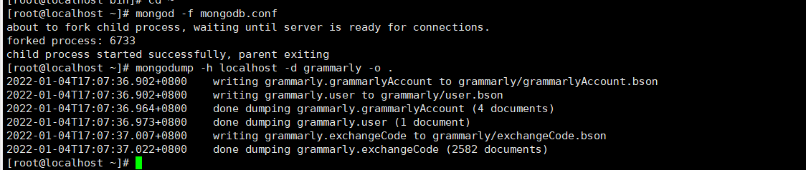
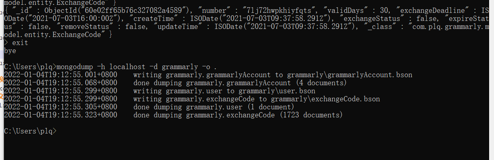
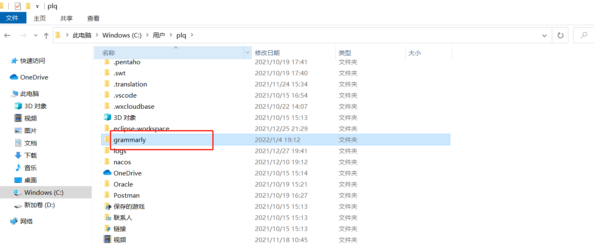
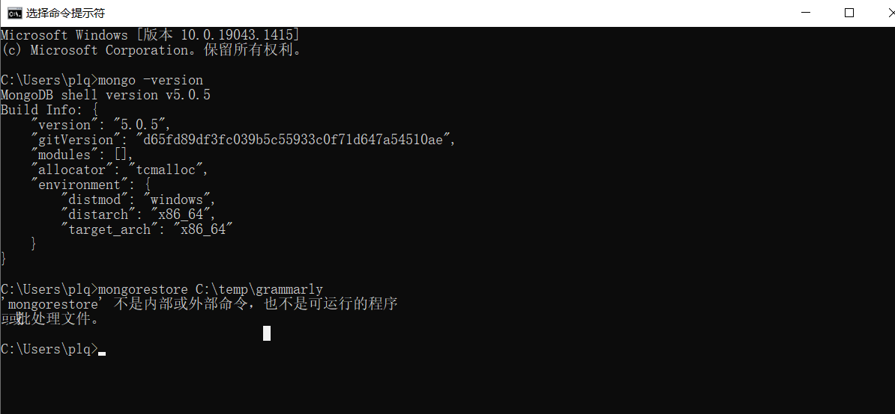
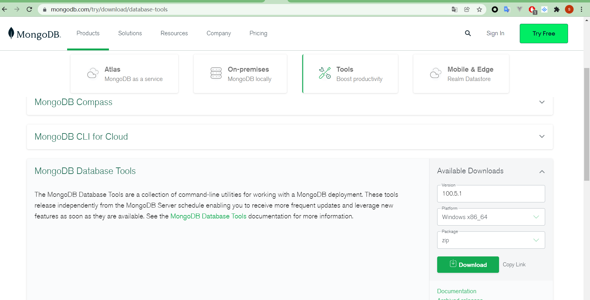
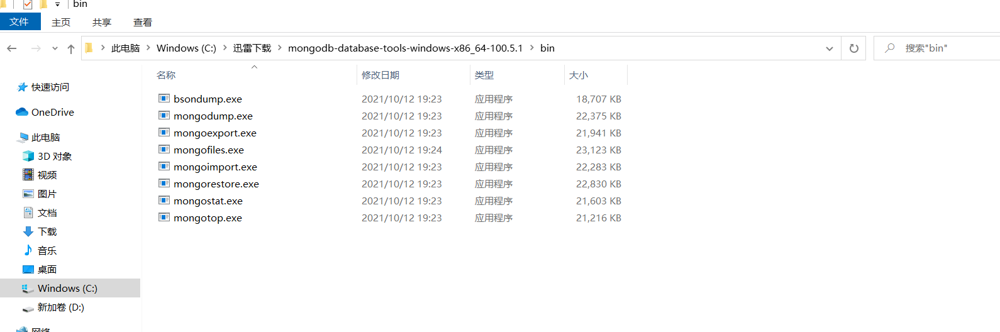
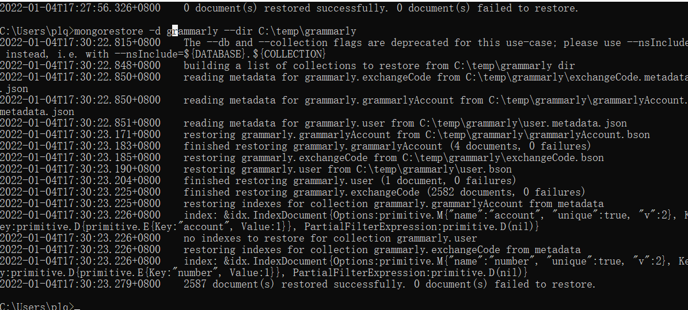
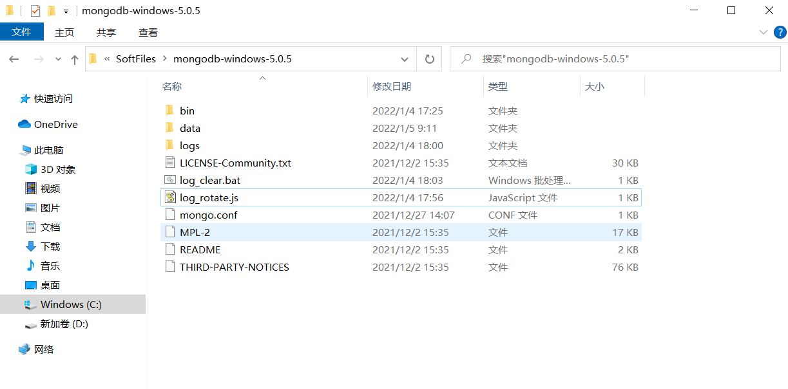
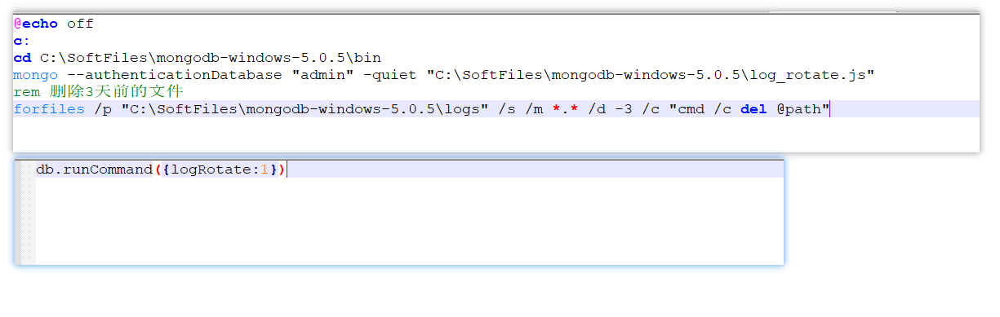

## 环境要求
* jdk11
* mongodb4.4

## 生产打包
* mvn clean package -P pro -DskipTests


## 数据库记录删除
命令行输入 mongo  
切换到数据库 use grammarly  


# 查询兑换成功且移除成功的文档
db.exchangeCode.find({exchangeStatus: true, removeStatus: true})

# 删除兑换成功且移除成功的文档
db.exchangeCode.deleteMany({exchangeStatus: true, removeStatus: true})

# 查询兑换成功且移除失败的文档
db.exchangeCode.find({exchangeStatus: true, errorMsg: {$ne: ''}})

# 删除兑换成功且移除失败的文档
db.exchangeCode.deleteMany({exchangeStatus: true, errorMsg: {$ne: ''}})

# 查找兑换到期的文档
db.exchangeCode.find({exchangeExpireStatus: true})

# 删除兑换到期的文档
db.exchangeCode.deleteMany({exchangeExpireStatus: true})

# 查找截止兑换日期小于2022年1月1号的且还未兑换的文档
db.exchangeCode.find({exchangeStatus: false, exchangeDeadline: {$lte: ISODate("2022-01-01T00:00:00Z")}})

# 删除兑换日期小于2022年1月1号的且还未兑换的文档
db.exchangeCode.deleteMany({exchangeStatus: false, exchangeDeadline: {$lte: ISODate("2022-01-01T00:00:00Z")}})


## 数据库备份
备份命令 mongodump -h localhost -d grammarly -o .  
  
  
  

## 数据库还原
环境变量设置mongo


安装开发者工具才能还原


下载开发者工具，解压把bin下文件解压到mongo目录下




还原命令 ```mongorestore -d grammarly --dir C:\temp\grammarly```



## 清理mongo日志文件
 
