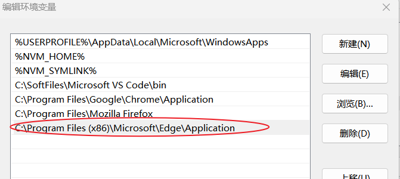
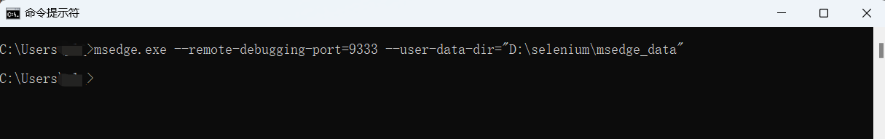

## 生产打包 
 > mvn clean package -P pro '-Dmaven.test.skip=true'

## 把edge浏览器加入系统环境变量Path中
 > edge浏览器一般在这个路径，C:\Program Files (x86)\Microsoft\Edge\Application
 

## win + R 打开 运行窗口， 执行下面命令启动edge浏览器
  > msedge.exe --remote-debugging-port=9333 --user-data-dir="D:\selenium\msedge_data"
  > 

## 再运行GrammarlyApplication启动